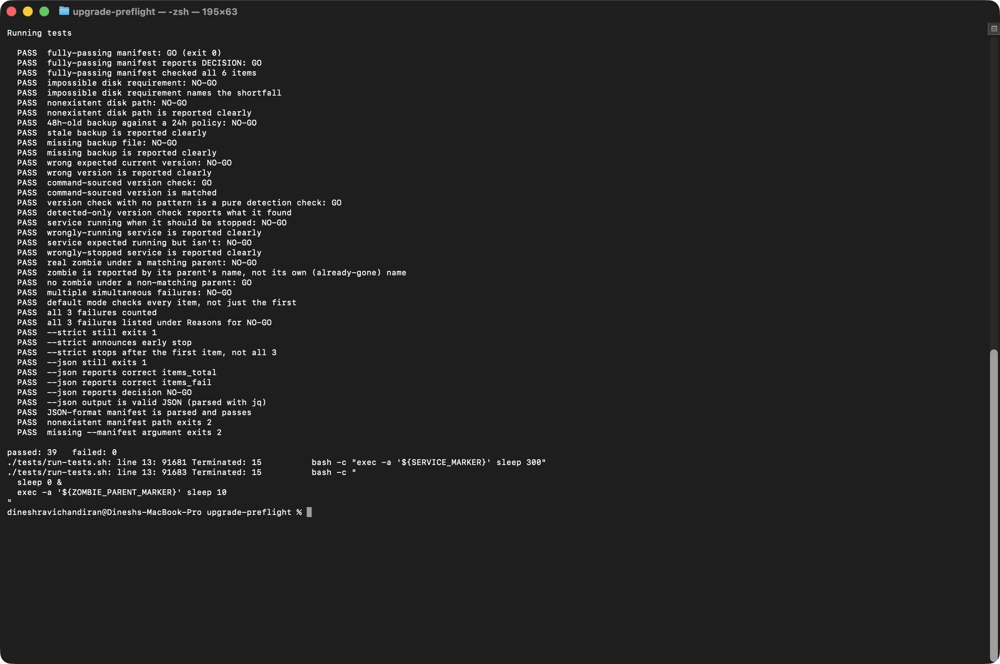

# upgrade-preflight

Answers one question before a deployment or upgrade begins: **is this
host actually ready?**

Reads a manifest describing what "ready" means for a given
application — free disk space, a recent backup, the version it's
currently supposed to be on, services in the state they need to be in
before the change starts, no leftover stuck processes — checks every
item against the live host, and prints a GO or NO-GO decision with
specific reasons for any NO-GO.

## Paired with deploy-validator

This is deploy-validator's before-the-change counterpart:

```
upgrade-preflight --manifest release-3.4.0.yaml --strict
  |
  +-- NO-GO --> stop. Fix what's listed, or don't start the change window.
  |
  +-- GO -----> proceed with the upgrade
                  |
                  v
              deploy-validator --manifest release-3.4.0.yaml --strict
                  |
                  +-- exit 0 --> change window closes
                  +-- exit 1 --> pipeline fails / rollback / escalate
```

Same manifest-driven design (YAML or JSON, auto-detected by extension),
same `report()`/exit-code shape (`0`/`1`/`2`/`3`, PASS/FAIL, `--strict`,
`--json`), same pgrep-self-exclusion fix in the service check — on
purpose. The two are meant to be read together, and a change in one's
conventions without the other would make them harder to trust as a pair,
not easier.

## What it checks

- **Disk space** — available space on one or more paths against a
  configured minimum, in MB.
- **Backup freshness** — the backup file exists and its mtime is within
  a configured maximum age, in hours (not days — see "Bugs this caught,"
  below).
- **Current version** — the application is actually on the version this
  upgrade expects to start from, read from a file or the output of a
  command (whichever the application actually exposes). With no expected
  pattern configured, this becomes a pure "can we detect a version at
  all" check.
- **Service state** — each named service is running or stopped,
  whichever the manifest says it should be before the change starts
  (most upgrades want services stopped; some pre-checks want a dependency
  already running).
- **No stuck zombie processes** — scoped to a configurable pattern, not
  "any zombie anywhere" (see "Bugs this caught" for why this matches on
  the zombie's *parent* process, not the zombie itself).

## Manifest format

```yaml
disk_space:
  - path: /opt/app
    min_free_mb: 5000

backups:
  - path: /backups/app-latest.tar.gz
    max_age_hours: 24

versions:
  - source: file          # file | command
    path: /opt/app/VERSION
    pattern: "3.3."        # optional -- omit to just check detection succeeds

services:
  - name: app-server
    expected_state: stopped   # running | stopped

zombie_patterns:
  - app-worker
```

See `conf/example-manifest.yaml` and `conf/example-manifest.json` for
complete, runnable examples against a generic web application upgrade.
Nothing in either refers to a real company, product, or hostname.

## Usage

```bash
# Check everything, see every reason for NO-GO
./bin/upgrade-preflight --manifest release-3.4.0.yaml

# Gate a change-management step: stop at the first problem
./bin/upgrade-preflight --manifest release-3.4.0.yaml --strict

# Machine-readable output for a pipeline to parse
./bin/upgrade-preflight --manifest release-3.4.0.yaml --json
```

## Tests

```bash
./tests/run-tests.sh
```



39 assertions, run against the real `bin/upgrade-preflight` binary, no
mocking: a real directory for the disk-space check, a real file with its
mtime deliberately set 48 hours in the past for the stale-backup case, a
real backgrounded process with a unique marker for the service check, and
a genuine zombie process (a real child left unreaped under a real
parent) for the zombie check. All fixtures are cleaned up in a trap on
exit whether the suite passes or fails.

## Bugs this caught during development

**A zombie process's own name is already gone by the time you're looking
at it.** The first version of the zombie check matched the configured
pattern against the zombie's own `comm` field
(`ps -eo stat,pid,comm | awk '$1 ~ /Z/'`). Testing it against a real
zombie (deliberately created by backgrounding a child under a parent
that sleeps without reaping it) showed the problem immediately: macOS's
`ps` reports every zombie's command as a bare `<defunct>`, with no trace
of what it used to be. Linux's `ps` is kinder about this (it keeps the
name, e.g. `app-worker <defunct>`), but relying on that would make the
check silently useless on macOS specifically — it would never match
anything, ever, and report a clean bill of health regardless of what was
actually stuck. Fixed by matching the pattern against the *parent*
process's name instead (still alive, still has a real name on both
platforms) — which turns out to be the more useful signal anyway: a pile
of zombies under one specific parent is exactly what a worker pool that
stopped reaping its children looks like.

**Day-granularity retention checks silently accept a backup up to 47
hours old under a "24 hour" policy.** `windchill-ops-toolkit`'s log
cleanup uses `find -mtime +N` (whole days) for its retention check, which
is the right granularity for "delete logs older than 30 days." Copying
that pattern for backup freshness would have been wrong: `find -mtime
+1` treats anything less than 2*24h old as passing, so a backup from 30
hours ago — already a full day stale against a "must be under 24h"
policy — would have been silently accepted. Used `find -mmin` (minutes)
instead, which both GNU and BSD `find` support identically, and computed
the threshold as `max_age_hours * 60`.

**`df -hP`'s silently-wrong units on macOS, avoided by knowing to look
for it.** `windchill-ops-toolkit`'s disk check hit this directly:
BSD/macOS `df`'s `-P` flag silently forces raw 512-byte blocks and
ignores `-h` entirely, so a "free space" figure came out looking like
bytes but was actually ~200x too small. `check_disk_space` here uses
`-kP` (1024-byte blocks, unambiguous on both `df` flavors) from the
start, converting to MB explicitly rather than trusting either `df`'s
`-h`.

## Scope and limitations

This checks host-level readiness signals visible through the OS and the
filesystem. It doesn't understand the application's internal state (a
backup file that exists and is recent but is actually corrupt, a service
that's "stopped" cleanly but left a half-finished transaction behind) —
it's a first-pass gate meant to catch the common, mechanical ways an
upgrade starts from a bad position, the same way `deploy-validator`
catches the common, mechanical ways one lands badly.
