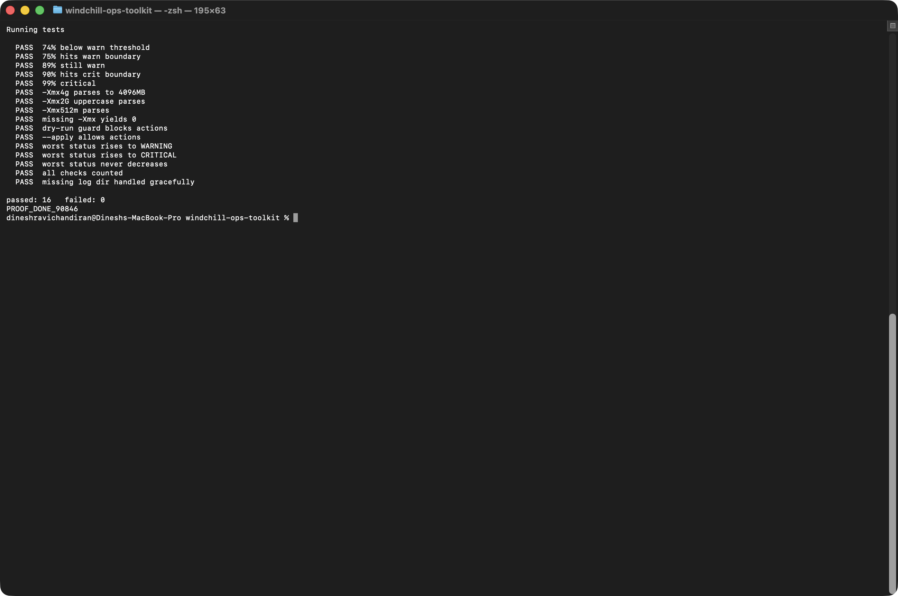

# PLM Ops Toolkit

Pre-change and post-change health checks for Windchill-style application hosts
(Apache, Tomcat, JVM, disk, logs).

Built from patterns I use running controlled changes on production PLM
environments: capture a baseline, make the change, validate against the
baseline, and keep rollback available at every step.

## Why this exists

Most routine PLM host problems are boring and preventable. Vaults and log
directories fill up. A service comes back after a restart but is not actually
serving. Heap creeps toward `-Xmx` for weeks before anyone sees an
OutOfMemoryError.

The checks themselves are not complicated. What matters is running the same
checks the same way every time, before and after a change, so that "did this
change break something" has an evidence-based answer instead of a guess.

## Design decisions

**Report-only by default.** Nothing is deleted unless `--apply` is passed
explicitly. A routine health check should never destroy evidence that an open
investigation might need.

**Nagios-convention exit codes.** `0` OK, `1` WARNING, `2` CRITICAL, `3`
UNKNOWN. The script exits with the worst status seen, so Zabbix, Nagios or any
monitoring agent can consume it directly with no wrapper.

**Degrades instead of failing.** A missing directory or an absent service is
reported and skipped, not treated as a crash. The same script runs unmodified
across hosts with different software installed.

**Baseline comparison ignores noise.** Timestamps, PIDs and byte counts are
normalised before diffing, so a comparison surfaces genuine status changes
rather than the fact that time passed.

## Usage

```bash
# Capture a baseline before a change window
./bin/plm-healthcheck.sh --baseline /tmp/pre-change.txt

# ... apply the change ...

# Validate afterwards and diff against the baseline
./bin/plm-healthcheck.sh --compare /tmp/pre-change.txt

# Routine maintenance run that actually reclaims old logs
./bin/plm-healthcheck.sh --apply

# Machine-readable output for a monitoring agent
./bin/plm-healthcheck.sh --json
```

### Example output

```
PLM host health check  |  appsrv01  |  2026-09-17 14:22:03
mode: report-only (use --apply to perform cleanup)

Filesystem
[OK      ] disk:/                     42% used, 58G free on /
[WARNING ] disk:/opt/ptc              83% used, 41G free on /opt/ptc

Services
[OK      ] service:httpd              active (systemd)
[OK      ] service:tomcat             active (systemd)

JVM
[WARNING ] jvm:heap                   pid 4181: RSS 3201MB of Xmx 4096MB (78%)

Logs and temporary files
[WARNING ] logs:/opt/ptc/Windchill/logs   214 file(s) older than 30d, ~1.9GB reclaimable
  would delete 214 log file(s) (dry-run)

Summary
  checks run : 6
  ok         : 3
  warning    : 3
  critical   : 0
```

## Checks implemented

| Check | What it catches |
|---|---|
| Disk usage | Vault and log growth before it takes the application down |
| Service liveness | systemd state, with process-table fallback |
| Port reachability | Service listening but not accepting connections |
| JVM heap | RSS against configured `-Xmx`, with percentage thresholds |
| Ageing logs | Reclaimable space, reported before anything is deleted |
| Stale temp files | Slow disk exhaustion from accumulated temp data |
| HTTP endpoint | Post-restart validation that the app actually serves |

## Configuration

Copy `conf/toolkit.conf.example` to `conf/toolkit.conf` and edit. Every value
has a safe default, so the script runs with no configuration at all.

```bash
DISK_WARN_PCT=80
DISK_CRIT_PCT=90
JVM_WARN_PCT=75
JVM_CRIT_PCT=90
LOG_RETENTION_DAYS=30
LOG_DIRS="/opt/ptc/Windchill/logs /var/log/tomcat"
SERVICES="httpd:httpd tomcat:catalina"
```

## Tests

```bash
./tests/run-tests.sh
```



16 tests covering threshold boundaries, `-Xmx` parsing (`4g`, `2G`, `512m`,
absent), the dry-run guard, worst-status propagation, and graceful handling of
missing paths. No external test framework required.

## Requirements

Bash 3.2+, standard coreutils. `curl` only if HTTP endpoint checks are used.
Tested on Linux and on macOS's shipped `/bin/bash` (3.2).

## Scope and limitations

This validates the host and application layer. It does not talk to Windchill's
internal APIs, read the Windchill database, or parse method server queues. It
deliberately stops at what can be checked from the OS without application
credentials, which is what makes it safe to run on any host in an estate.

Paths in the example configuration follow a common Windchill layout but are
configurable; nothing here is specific to one installation.
